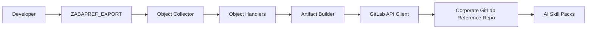

# abapgit-gitlab-lite

Lightweight ABAP export utility for publishing a static GitLab reference repository
of custom SAP code and metadata for AI skill packs.

## What This Project Does

This project exports selected SAP custom developments into a **readable GitLab
reference repository**. The exported repository is meant to help AI skill packs
and developers:

- understand existing custom code,
- analyze technical patterns,
- propose fixes,
- recommend enhancements,
- provide better maintenance guidance without direct SAP access.

The target repository is **not** the system of record and **not** intended to be
used for transport or version management. SAP remains the real source of truth.

## What It Does Not Do

- It does not replace transports
- It does not replace Git-based development
- It does not import changes back into SAP
- It does not implement branch/merge workflows
- It does not try to be a full `abapGit` alternative

## How It Works

### Functional flow

1. A developer runs `ZABAPREF_EXPORT` from SAP GUI
2. The tool reads custom objects from SAP package scope
3. Object handlers build export bundles per supported object type
4. The tool generates:
   - source files
   - `metadata.json`
   - `summary.md`
   - refresh manifests
   - indexes
5. The tool prepares GitLab commit actions
6. The reference artifacts are published to a static GitLab repository

### High-level architecture



## Why This Exists

In corporate SAP environments, direct Git-driven development is often not the
right operating model for support and enhancement work. What teams usually need
instead is a **stable reference codebase** that can be refreshed manually when
needed and consumed by AI tooling.

This project implements exactly that operating model.

## Design Principles

- SAP is the source of truth
- GitLab is a read-only reference target for consumers
- Refresh is manual and developer-triggered
- Repository structure must be stable and machine-readable
- Metadata and summaries are first-class artifacts
- Missing objects are soft-retained by default

## Current Scope

### Supported v1 object types

- `CLAS`
- `INTF`
- `PROG`
- `DTEL`
- `DOMA`
- `TABL`

### Planned later

- `TTYP`
- `VIEW`
- `DDLS`
- `FUGR`
- `MSAG`

## Repository Structure

The intended GitLab reference layout is:

```text
/reference/systems/<system-id>/
  manifests/
    latest-refresh.json
  indexes/
    object-index.csv
    package-index.csv
  objects/
    CLAS/<object-name>/
      source.abap
      metadata.json
      summary.md
```

## Prerequisites

### SAP prerequisites

- ABAP development access
- ability to create report, interface, and classes
- access to required repository metadata APIs
- read access to custom package content

### Connectivity prerequisites

- outbound HTTPS from SAP to corporate GitLab
- SSL trust and proxy path already available or minimally enabled
- approved GitLab project or group token

### GitLab prerequisites

- target repository created in GitLab
- reference branch available, usually `main`
- token scoped for API/repository write usage

## Step-by-Step Implementation

### Step 1. Configure export profile

Create a profile source for:

- GitLab base URL
- project id/path
- branch name
- repository root
- token alias
- default package

Current scaffold:

- profile is returned by `ZCL_ZREF_PROFILE`
- secure lookup is still a TODO

### Step 2. Collect candidate objects

`ZCL_ZREF_OBJECT_COLLECTOR` currently:

- reads TADIR for the selected package
- limits to `R3TR`
- keeps custom `Z*` and `Y*` objects
- logs that subpackage expansion is still pending

### Step 3. Serialize supported objects

`ZCL_ZREF_SERIALIZER`:

- registers handlers
- selects the right handler by object type
- builds export bundles
- generates AI summaries
- adds common `metadata.json` and `summary.md` files

### Step 4. Build manifests and indexes

`ZCL_ZREF_MANIFEST` currently builds:

- `latest-refresh.json`
- `object-index.csv`
- `package-index.csv`

### Step 5. Publish to GitLab

`ZCL_ZREF_GITLAB_CLIENT` currently:

- builds commit message
- builds publish action list
- logs the prepared commit scope

The actual HTTPS call to GitLab is still a TODO in the scaffold.

### Step 6. Run preview or publish

`ZABAPREF_EXPORT` supports:

- preview mode
- package selection
- profile selection
- force refresh flag

## Detailed Documentation

- `docs/abapgit-mini-analysis.md`
- `docs/options-comparison.md`
- `docs/architecture-one-pager.md`
- `docs/implementation-guide.md`

## Simulation and Validation

This repository also includes a local simulation script for validating the
reference repository shape and publish-action logic without SAP access:

- `scripts/simulate_reference_export.py`

Run it with:

```bash
python3 scripts/simulate_reference_export.py
```

It checks:

- object folder layout
- metadata and summary artifact presence
- manifest JSON validity
- index file generation
- publish action assembly

## Current Status

This repository contains:

- architecture and implementation documentation
- ABAP exporter scaffold
- object handler boundaries
- manifest and publish-action assembly logic
- local simulation support

## Important Current Gaps

The scaffold still needs live SAP/GitLab implementation for:

- secure profile and token lookup
- true object extraction from SAP repository APIs
- subpackage expansion
- checksum-based delta comparison
- live GitLab REST API commit execution
- soft-retention status handling in manifests
