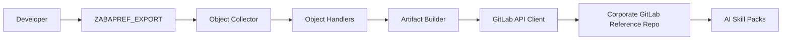
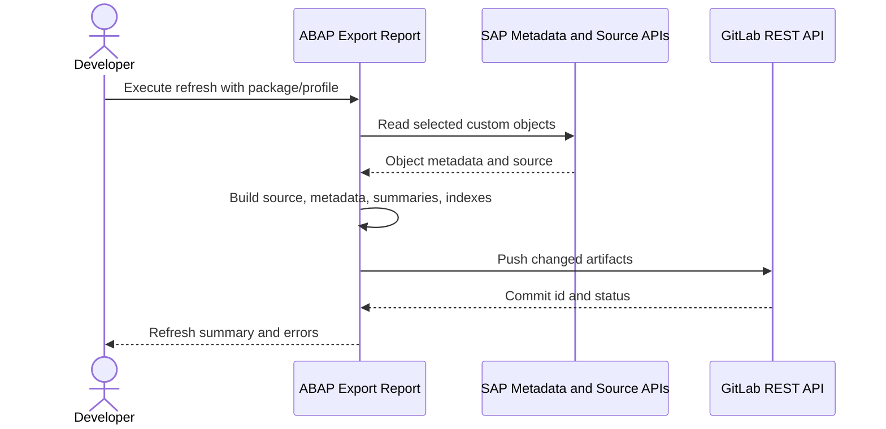

# Architecture One-Pager

## Objective

Publish selected SAP custom objects into a stable GitLab reference repository so
AI skill packs can use the exported code, metadata, and summaries as support
context for maintenance and enhancement work.

## Actors

- Developer
- ABAP reference export report
- SAP repository APIs
- GitLab reference repository
- AI skill packs

## Flow



## Runtime Sequence



## Components

| Component | Responsibility |
|---|---|
| `ZABAPREF_EXPORT` | Selection screen and orchestration |
| `ZCL_ZREF_PROFILE` | Export settings and target resolution |
| `ZCL_ZREF_OBJECT_COLLECTOR` | Package/object discovery |
| `ZCL_ZREF_SERIALIZER` | Handler orchestration |
| `ZIF_ZREF_OBJECT_HANDLER` | Export contract per object type |
| `ZCL_ZREF_SUMMARY_BUILDER` | AI-facing summaries |
| `ZCL_ZREF_MANIFEST` | Manifest and index generation |
| `ZCL_ZREF_GITLAB_CLIENT` | GitLab API integration |
| `ZCL_ZREF_LOG` | Logging and refresh summary |

## Repository Shape

```text
/reference/systems/<system-id>/
  manifests/
  indexes/
  objects/CLAS/<object>/
  objects/INTF/<object>/
  objects/PROG/<object>/
  objects/DTEL/<object>/
  objects/DOMA/<object>/
  objects/TABL/<object>/
```

## Key Decisions

- Manual refresh only
- SAP is source of truth
- GitLab is read-only reference target for consumers
- Project/group token is the runtime auth mechanism
- Missing objects are soft-retained by default
